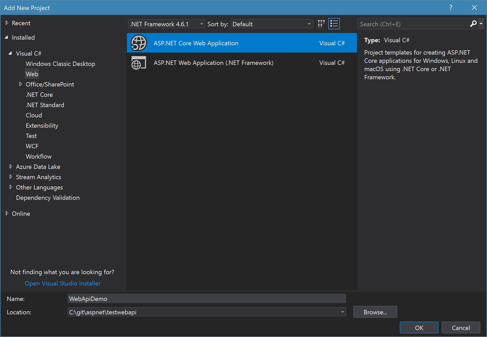
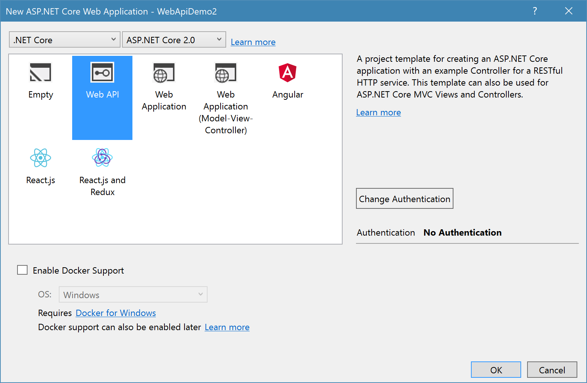
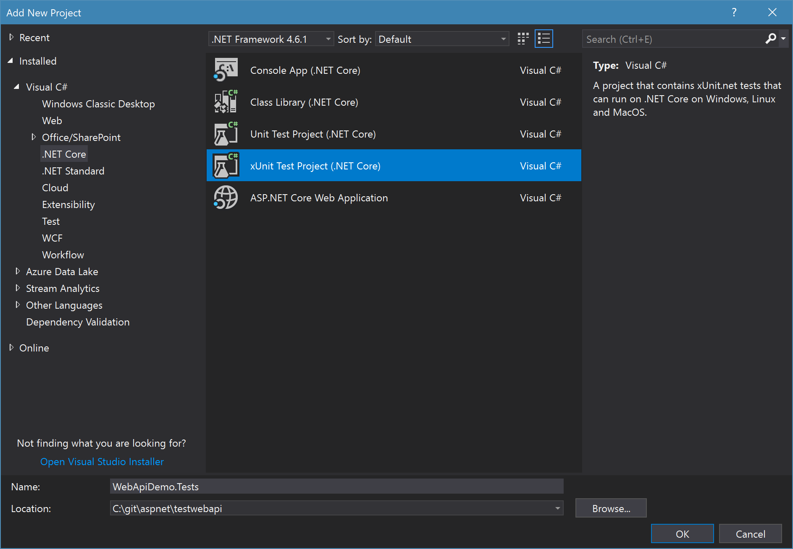

ASP.NET Core 2.0 is out and it is great. Testing worked well in the previous versions, but in 2.0 it is much more easier. 

Xunit, Moq and FluentAssertions are working great with the new Version of .NET Core  and ASP.NET Core. Using this tools Unit Testing is really fun. Even more fun with testing is provided in ASP.NET Core. Testing Controllers wasn't easier in the previous versions.

If you remember the old Web API and MVC version, based on System.Web, you'll propably also remember how to write unit test for the Controllers.

In this post I'm going to show you how to unit test controllers and hot write integration tests for your controllers.

## Preparing the project to test:

To show you how this works, I created a new "ASP.NET Core Web Application" : 

Now I needed to select the Web API project. Be sure to select ".NET Core" and "ASP.NET Core 2.0":

To keep this post simple, I didn't select an authentication.

In this project is nothing special, except the new PersonsController. This Controller uses GenFu to auto generate a list of Persons:

~~~ csharp
[Route("api/[controller]")]
public class PersonsController : Controller
{
  private List<Person> Persons { get; set; }

  public PersonsController()
  {
    var i = 0;
    Persons = A.ListOf<Person>(50);
    // override autogenerated random ids
    Persons.ForEach(person =>
    {
      i++;
      person.Id = i;
    });

  }

  // GET api/values
  [HttpGet]
  public async Task<IActionResult> Get()
  {
    var models = Persons;
    return Ok(models);
  }

  // GET api/values/5
  [HttpGet("{id}")]
  public async Task<IActionResult> Get(int id)
  {
    var model = Persons.First(_ => _.Id == id);

    return Ok(model);
  }

  // POST api/values
  [HttpPost]
  public async Task<IActionResult> Post([FromBody]Person model)
  {
    if (!ModelState.IsValid)
    {
      return BadRequest(ModelState);
    }

    var newid = Persons.OrderBy(_ => _.Id).Last().Id + 1;
    model.Id = newid;

    Persons.Add(model);

    return CreatedAtRoute("Get", new { id = model.Id }, model);
  }

  // PUT api/values/5
  [HttpPut("{id}")]
  public async Task<IActionResult> Put(int id, [FromBody]Person model)
  {
    if (!ModelState.IsValid)
    {
      return BadRequest(ModelState);
    }

    var person = Persons.First(_ => _.Id == id);
    person.FirstName = model.FirstName;
    person.LastName = model.LastName;
    person.Address = model.Address;
    person.Age = model.Age;
    person.City = model.City;
    person.Email = model.Email;
    person.Phone = model.Phone;
    person.Title = model.Title;

    return NoContent();
  }

  // DELETE api/values/5
  [HttpDelete("{id}")]
  public async Task<IActionResult> Delete(int id)
  {
    return NoContent();
  }
}
~~~

The Person class is created in a new folder "Models" and is a simple POCO:

~~~ csharp
public class Person
{
  public int Id { get; set; }
  public string FirstName { get; set; }
  public string LastName { get; set; }
  public string Title { get; set; }
  public int Age { get; set; }
  public string Address { get; set; }
  public string City { get; set; }
  public string Phone { get; set; }
  public string Email { get; set; }
}
~~~

If this is done, we can create the test project.

## The unit test project

I always choose xUnit (or Nunit) over MSTest, but feel free to use it. The used testing framework doesn't really matter.

Inside that project I created two test classes: PersonsControllerIntegrationTests and  PersonsControllerUnitTests

We need to add some NuGet packages: 

~~~ xml
<PackageReference Include="Microsoft.AspNetCore.All" Version="2.0.0" />
<PackageReference Include="Microsoft.AspNetCore.TestHost" Version="2.0.0" />
<PackageReference Include="FluentAssertions" Version="4.19.2" />
<PackageReference Include="Moq" Version="4.7.63" />
~~~

The first package contains the dependencies to ASP.NET Core. I use the same package as in the project to test. The second package is used for the integration tests, to build a test host for the project to test. FluentAssertions provides a more elegant way to do assertions. And Moq is used to create fake objects.

Let's start with the unit tests:

## Unit Tests

## Integration tests