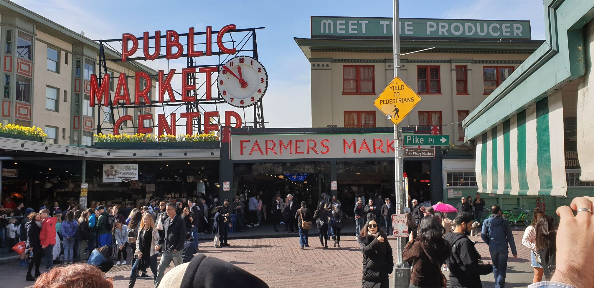
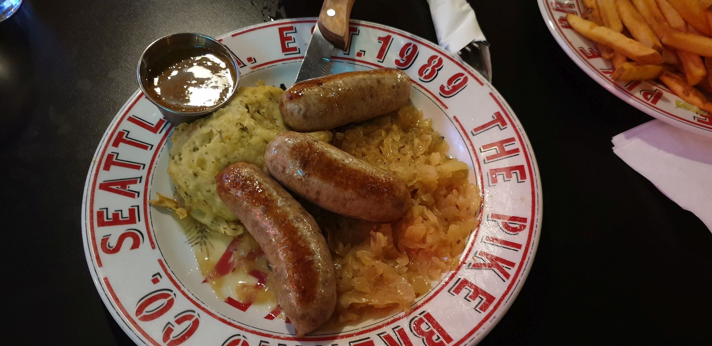
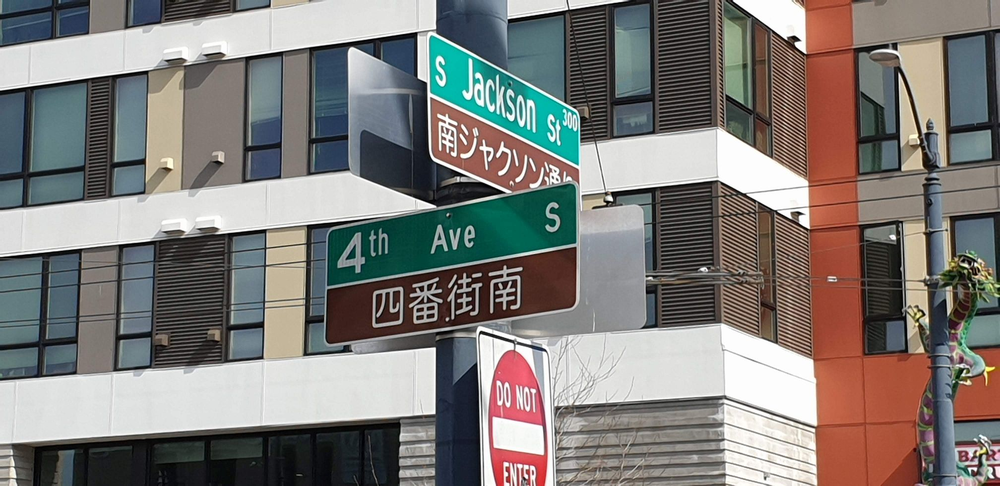
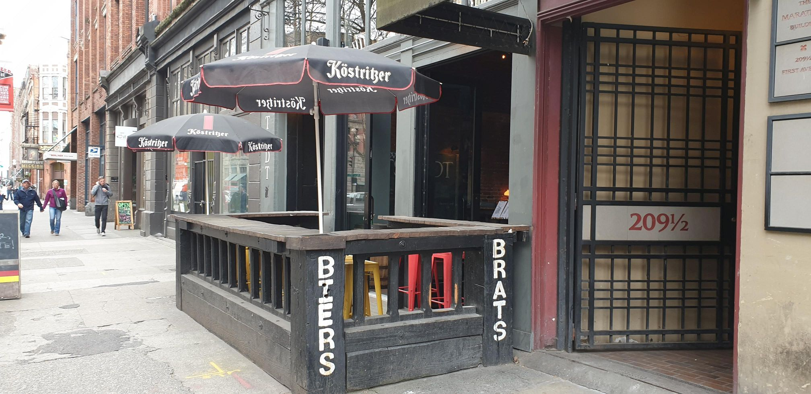
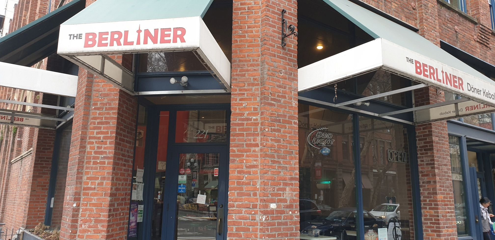

Also this year I was invited to attend the yearly Global MVP Summit in Redmond and Bellevue. It started last week Sunday until Thursday. As last year I add two days before and after the summit to get some time to explore Seattle. This is a small summery of the 8 days in the Seattle area.

Just to weeks before the summit starts there was the so called [#snowmageddon2019](https://twitter.com/search?q=%23snowmageddon2019) in the north west of the US. Cold and a lot of snow from the US perspective. But I was sure, when I will arrive in Seattle it'll be sunny and warm. And it was. I never had a rainy day in Seattle. In Bellevue and Redmond I had, but never in Seattle. Also last year I stayed two nights before and two nights after the summit in downtown Seattle and it was sunny than, but rainy while staying in Bellevue. Anyway, Seattle is always sunny, people are happy and friendly.

## Pre-Summit days in Seattle

As well as last year I stayed the first two nights in the Green Tortoise Hostel in downtown Seattle near the Pike place. This is a cheap hostel, you need to share the room with six to eight other people. But it is anyway impressive. The weekend when I arrived it was ComiCon in Seattle and Sint Patrick's day. So the hostel was full of ComiCon attendees, people wearing green things, Backpackers, and some MVPs.

> I again met the South Korean Azure MVP in this hostel as last year, who gave me the sticker of his Korean Azure user group. I also met him the two nights after in the same hostel as well as during the summit

Even if the hostel is cheap, compared with the hotels in Seattle, the location is absolutely awesome. If you leave the hostel, you will stumble into the only Starbucks restaurant, that serves the Pike Place Special Reserve outside the Pike Place. Leaving the restaurant, you will stumble into the public market of the Pike Place where you can grab some pastries for breakfast. Than leaving the Pike Place to take the breakfast in the sun within the Victor Steinbrueck Park.

I arrived on Friday and took the Light Rail to Downtown Seattle, checked in to the Green Tortoise and went for a walk threw the Pike Place and had the first awesome burger at Lowell's Restaurant while enjoying the nice view to the Puget Sound. Saturday starts slowly with the breakfast described in the last paragraph. Later than I joined some MVPs for the guided Market Experience tour. Where I learned a lot about the market.

> Did you know that the fist Starbucks isn't really the first one, but the oldest one? Did you know that you need to found your business on the Pike Place to get a spot to sell your stuff? All you want to sell on the market needs to be produced by yourself (except meat, sausage and fish I think)

Later I joined some MVP Friends for lunch and for a walk to the space needle. We had lunch at the Pike Place Brewery where I found sausages, sauerkraut and meshed potatoes on the menu. Beer brazed sausages, with fine apple sauerkraut. Seattle meats Bavaria. I needed to try it and it was really yummy. 

In the evening we had free beer at the hostel. With free beer and my laptop I started to merge almost all of the pull requests to the [ASP.NET Core GraphQL Middlewares](https://github.com/JuergenGutsch/graphql-aspnetcore/), answered almost all open issues and updated the dependencies of the project.

## The Summit days in Bellevue and Redmond

The Sunday also started slowly, before I took the express bus to Redmond where the Summit hotels are located. I checked in to the Marriott Bellevue, where I shared the room with the famous Alex Witkowski. This room was awesome, with a great view to the space needle and a super modern stylish sliding door to the bathroom that cannot be locked and that always wasn't really closed. Felt strange while sitting on the toilet, but must be super modern for a 599$ room ;-)

Sunday is the day where the most of the MVPs registering for the summit at the biggest Summit Hotel. Some soft skill talks were held there too. The first parties organized by MVPs or tools vendors where on Saturday so we joined them and met the first Microsofties and other famous MVPs. it got late and the Monday got hard. Anyway the actual Summit starts on Monday with a lot of technical sessions.

From Monday to Wednesday there where a lot of more or less interesting technical sessions. Many of them really had a lot of value. Some others didn't contain new information for me, because the most stuff in my area was openly discussed on GitHub, but anyway clarified some rumors. 

> I really got into Razor Components, which is not about Blazor as I initially thought. Also Scott Hanselman did a clarification post about it. [link] Razor Components is component based development using Razor. It looks similar to React, even if it may be rendered on the server side, as well as on the client side using Blazor. Awesome stuff.

The Thursday also is a highlight for me. Thursday is hackathon day. I joined [Jeff Fritz](https://twitter.com/csharpfritz) who showed us his mobile streaming setup. I got a chance to talk to Jeff and to other Twitch streamers, like [Emanuele Bartolesi](https://twitter.com/kasuken). Besides of that I worked on the [ASP.NET Core CraphQL Middlewares](https://github.com/JuergenGutsch/graphql-aspnetcore/) and had a chance to get a review by [Glen Condron](https://twitter.com/condrong). He also told me that the way how a Middleware is created changed in 3.0 for Middlewares that handle a specific path. I'll write about it in one of the next posts. Glen and [James Newton King](https://twitter.com/JamesNK) who works on the new ASP.NET Core routing supported me to get it running for ASP.NET Core 3.0. 

## Post-Summit days in Seattle

On Thursday after the hackathon I moved back to Seattle into the Green Tortoise and again met the south Korean Azure MVP at the check-in. I used the night to work on the  ASP.NET Core CraphQL Middleware to finish the GraphQL Middleware registration using the route mapping. 

Friday was shopping day. My wife always need some pants from her favorite store Seattle and I need to buy some souvenirs for the Kids (usually some t-shirts). After this was done I decided to explore the international district and china town where I also had a quick lunch in on of the Asian restaurants. China town was less colorful than expected but nice anyway. An awesome detail: You know you are in china town, if the street names are printed in two languages.

I left china town and unexpectedly stumbled into the old part of Seattle. The Pioneer Square was surprisingly nice. Old houses, small shops and pubs. One of the pups sells a German stout beer "Köstritzer", as well as "Biers" and "Brats". 

Also found the "Berliner" döner and kebab restaurant, which is (as far as I know) the very first and the only real döner restaurant in the US.

In the evening I decided to go to the Hardrock Cafe across the street to take a dinner. I was there for the first time. I don't get why this is a popular place. Pretty loud, uncomfortable and the food is good but not really special. Anyway, I continued to get the GraphiQL Middleware (the GraphQL UI) running using the new route mapping and cleaned up all the changes. Free beer at the Green Tortoise and Coding matches pretty well.

Saturday was the day to fly back at home. The morning starts with the annual **JustCommunity Summit** at the Lowell's Restaurant in the Public Market area of the Pike Place. [Kostia](https://twitter.com/KostjaKlein) and I took a breakfast and talked about the plans of the [INETA Germany](http://ineta-germany.de/) and [JustCommunity](http://justcommunity.de/). Our goals: To have a strategy about the JustCommunity until the end of the year. We also need to lineup the INETA tasks with the community support of the [.NET Foundation](https://dotnetfoundation.org). 

## Leaving Seattle

This was the fifth time in Seattle which is one of the most impressive cities. Pretty diverse, fascinating and pretty much different to any other cities in the US I've bin (not that much unfortunately). 

Leaving Seattle is a little bit like leaving home. The last years I didn't know why. Now I'm pretty sure it is because I always meet friends, community members and many other nice people for the summit. The Summit is a little bit like a annual family meetup. 

But one week without the family is hard as well and it is time to go home to my lovely wife and the three boys :-)