## Evaluating a build server

Since a few months we use Azure Pipelines to build our projects to get red of our Azure WM that hosts the Jenkins build server. I still love Jenkins and I'm sure it is one of the best build server if you need to host a build server in your own environment. It has a huge community and supports a lot of platforms and tools. But managing a VM and getting the system and even Jenkins up-to-date is annoying and time consuming. That's why we were looking for a hosted build environment for a while.

We had a look into BitBucket pipelines, which runs on Linux based Docker container. This is a nice and integrated environment but only works for .NET Core and and other technology that is able to run on Linux. It is not possible to run builds against the full NET Framework.

Than Microsoft opens the Visual Studio Team Services and called it Azure DevOps. We were able to use the hosted build system without all the other TFS stuff. Azure Pipelines can be used completely independently. 

After a few tests we decided to move to Azure DevOps.

## Why CAKE?

Since a while we configure the builds of .NET based projects using CAKE. CAKE is C# based scripting language to configure builds. It is easy to use, runs upon .NET Core on every platform, has a huge community and because of that it can do almost everything. The community builds a ton of awesome add-ins.

> I think the only task you cannot do with CAKE is to start and land an airplane and I'm not really sure about that.

When I tell TFS people why we use CAKE and Azure DevOps in combination, they where a little bit wondering about that. Maybe it doesn't make sense from there perspective because Azure DevOps also supports tons of features and a lot more threw add-ins which are available in the marketplace. Azure DevOps is also configurable using YAML, similar to AppVeyor or BitBucket Pipelines which is nice.

But wouldn't it make sense for C# developers to configure the builds in C#? Or to use a programming language to program build logic? Or to use .NET Assemblies to extend this build tool?

It absolutely does!

CAKE is pretty much accepted by our .NET developers. Because of C# and because it simply works.

The biggest benefit was visible while moving all the existing builds from Jenkins to Azure DevOps. It took me just 4 hours to move and test around 24 builds, including the deployment parts. 

It could have been done much faster, but I took the chance to optimize the CAKE builds a little bit. 

This is why the builds are configured using CAKE.

## The CAKE build template

We use a default structure that will be modified depending on the project we wanna build. Since we in the .NET team the most time work on web applications, it looks almost the same:

~~~ csharp
var target = Argument("target", "Default");
var configuration = Argument("configuration", "Release");

var branchname = Argument("branchname", "master");
var environment = branchname == "master" ? "Production" : "Development";

var buildnumber = Argument("buildnumber", "0");
var publishfolder = Argument("publishfolder", "./drop/");

var buildtag =  environment != "Production" ? String.Format("-build{0}", buildnumber) : "";
var version = "1.0.0";
var artifactName = $"WebToDeploy-{version}{buildtag}.zip";

Task("CleanDirectory")
	.Does(() =>
	{
		CleanDirectory("./published/");
	});

Task("DotNetRestore")
	.IsDependentOn("CleanDirectory")
	.Does(() => {
		DotNetCoreRestore("./src/WebToDeploy.sln");
	});

Task("DotNetBuild")
	.IsDependentOn("DotNetRestore")
	.Does(() => 
	{	
		var settings = new DotNetCoreBuildSettings
		{
			Configuration = configuration,
			NoRestore = true
		};
		DotNetCoreBuild("./src/WebToDeploy.sln", settings);
	});

Task("DotNetTest")
	.IsDependentOn("DotNetBuild")
	.Does(() => 
	{
		var settings = new DotNetCoreTestSettings
		{
			Configuration = configuration,
			NoBuild = true,
			VSTestReportPath = "./testresult.xml"
		};
		DotNetCoreTest("./src/WebToDeploy.Tests/", settings);
	});

Task("DotNetPublish")
	.IsDependentOn("DotNetTest")
	.Does(() => 
	{	
		var settings = new DotNetCorePublishSettings
		{
			Configuration = configuration,
			OutputDirectory = "./published/",
			ArgumentCustomization = args => args
                .Append($"/p:Version={version}")
                .Append($"/p:FileVersion={version}")
                .Append($"/p:Assembly={version}")
                .Append($"/p:InformationalVersion={version}{buildtag}"),
			NoRestore = true
		};
		DotNetCorePublish("./src/WebToDeploy/", settings);
	});

Task("PackApplication")
	.IsDependentOn("DotNetPublish")
	.Does(() => 
	{
		var target = $"./published/{artifactName}";
		Zip("./published/", target);
		Information($"Packed to {target}.");
	});

Task("PublishArtifact")
	.IsDependentOn("PackApplication")	
	.Does(() => 
	{
		var source = $"./published/{artifactName}";
        var target = System.IO.Path.Combine(publishfolder, artifactName):
		CreateDirectory(publishfolder);
		CopyFile(source, target);
		Information($"Published to {target}.");
	});

Task("Default")
	.IsDependentOn("PublishArtifact")
	.Does(() =>
	{
		Information($"You build of version '{version}{build}' is done!");
	});
	
RunTarget(target);
~~~

If you already know MSBuild you definitely see some similarities. We have variables defined at the beginning and tasks which will be executed in a specific order that is defined with the dependencies between the tasks. This is equal to MSBuild and almost equal to other Build scripts like e.g. FAKE. If zou already know CAKE or any other Build language like FAKE, RAKE or whatever you can skip the next section

### Let's have a more detailed look into the CAKE script

In the beginning we have some variables defined that get filled with command line arguments or default values. The CAKE function Argument retrieves an argument by name defined in the first parameter and sets the default value defined in the second parameter if no argument is passed to the script

The first one target is maybe the most important one and is used at the end of the script. These variable defines the target task that needs to be executed.

~~~ csharp
var target = Argument("target", "Default");
var configuration = Argument("configuration", "Release");

var branchname = Argument("branchname", "master");
var environment = branchname == "master" ? "Production" : "Development";

var buildnumber = Argument("buildnumber", "0");
var publishfolder = Argument("publishfolder", "./drop/");

var buildtag =  environment != "Production" ? String.Format("-build{0}", buildnumber) : "";
var version = "1.0.0";
var artifactName = $"WebToDeploy-{version}{buildtag}.zip";
~~~

The configuration is the build configuration (Release or Debug). 

We also pass in the branch name and usually we define the target environment based on the branch name. That means in this case, only the master branch will go into the production environment. 

We pass in the build number generated by the build server and the publish folder used by the build server. This information are defined by the build server and vary depending what build server is used and mostly a full file path is needed to do operations. 

The variable buildtag contains the build number in case it is not a production build. This is maybe special and may differ in other build strategies. We say the build number is not relevant for the production build, because we tag the sources with the current release or hotfix version defined in the version variable. This way we are able to see what version was built out what source code version. If we need to do a hotfix for a specific version, we checkout the specific tag and fix the bug. The build tag gets more relevant on development builds or builds on feature branches, because we don't tag commits here. The build tag also gets relevant of we produce NuGet packages. If we add the build tag to a version number the NuGet package will be marked as a prerelease package. This is useful for development builds.

At the end we create the artifact name using the project name the version number we work on and the build tag if defined. In the most cases it will be a Zip package, that can be deployed to an Azure app service later on using Azure Pipelines automatically.

The first two tasks are pretty clear. The first one clears the build output folder and any other folder you need to clear. This could also be configured by the build server, but this way we can run the build everywhere, as well as on the local development machine. ClearDirectory is a built in CAKE function:

~~~ csharp
Task("CleanDirectory")
	.Does(() =>
	{
		CleanDirectory("./published/");
	});

Task("DotNetRestore")
	.IsDependentOn("CleanDirectory")
	.Does(() => {
		DotNetCoreRestore("./src/WebToDeploy.sln");
	});

~~~

Also the DotNetCore[something] functions are built in into CAKE. This methods are wrapper around the .NET CLI. This means you are able to pass in the same arguments as on the command line, but nicely wrapped with C#. That means as well you are able to pass a path of a solution file, even if it is documented different, because you can do the same on the .NET CLI.

We do a .NET Core build here but the same tasks are needed for .NET Framework builds. Just by using different CAKE functions.

We do the restore before the build, even if the restore can be done on the actual build, but this may speed up the overall build a little bit.

The actual build is a little more complex:

~~~ csharp
Task("DotNetBuild")
	.IsDependentOn("DotNetRestore")
	.Does(() => 
	{	
		var settings = new DotNetCoreBuildSettings
		{
			Configuration = configuration,
			NoRestore = true
		};
		DotNetCoreBuild("./src/WebToDeploy.sln", settings);
	});
~~~

Not really complex, but we need to define a settings object to configure the build. We switch of the restore and pass in the build configuration we retrieve via the command line arguments. As well as on the restore task we build the entire solution.

Also the tests need some configuration:

~~~ csharp
Task("DotNetTest")
	.IsDependentOn("DotNetBuild")
	.Does(() => 
	{
		var settings = new DotNetCoreTestSettings
		{
			Configuration = configuration,
			NoBuild = true,
			VSTestReportPath = "./testresult.xml"
		};
		DotNetCoreTest("./src/WebToDeploy.Tests/", settings);
	});
~~~

We also pass the build configuration, which is maybe not needed because we switch off the build. By default  `dotnet test` may also build the application, but this is not needed, because we built the application previously. This will also speed up the build. We also define the build output, which is VSTest here, but could also be NUnit, XUnit. BTW: The tests are written in Xunit, but `dotnet test` is able to create a different output, which is pretty useful depending on the build server you wanna use. Azure Pipelines is able to read different test log formats.

As a next step we need to publish the application to get it ready for production on Azure or IIS:

~~~ csharp
Task("DotNetPublish")
	.IsDependentOn("DotNetTest")
	.Does(() => 
	{	
		var settings = new DotNetCorePublishSettings
		{
			Configuration = configuration,
			OutputDirectory = "./published/",
			ArgumentCustomization = args => args
                .Append($"/p:Version={version}")
                .Append($"/p:FileVersion={version}")
                .Append($"/p:Assembly={version}")
                .Append($"/p:InformationalVersion={version}{buildtag}"),
			NoRestore = true
		};
		DotNetCorePublish("./src/WebToDeploy/", settings);
	});
~~~

This looks similar to the `DotNetBuild` Task, but we also specify an output path as well as MSBuild parameters to set the version numbers to the assemblies. The task `DotNetCorePublish` executes a `dotnet publish` command in the background. The informational version number is also used to create the NuGet version. This is why we add the build tag here. As written before in NuGet the fourth version number is used to specify whether the artifact is a prerelease or not. 

At the end we pack the publish output and move the package to the output folder:

~~~ csharp
Task("PackApplication")
	.IsDependentOn("DotNetPublish")
	.Does(() => 
	{
		var target = $"./published/{artifactName}";
		Zip("./published/", target);
		Information($"Packed to {target}.");
	});

Task("PublishArtifact")
	.IsDependentOn("PackApplication")	
	.Does(() => 
	{
		var source = $"./published/{artifactName}";
        var target = System.IO.Path.Combine(publishfolder, artifactName):
		CreateDirectory(publishfolder);
		CopyFile(source, target);
		Information($"Published to {target}.");
	});
~~~

In the `PackApplication` task we use the built-in function Zip to pack the publish output into a zip file. The zip file may also be used by Azure DevOps later on to deploy the package to an Azure App Service. Depending on the size of the application, this may be the most time consuming task in the build.

`PublishArtifact` moves the zip file to the target folder, which is `drop` by default or the artifact folder on the build server.

The last task in this template is just the entry point without any functionality.

## Azure DevOps

Also in Azure DevOps it is possible to create something like a template for your build. I took the first build configuration as a template and reused it for the rest of them. Per build I needed to configure the connection to the version control, to configure the connection to the Azure Subscription and to set the name and that's it. The template already contains the call of the CAKE script, which always is called build.cake. It also contains the items to publish the test result and the artifact. So it was always about copy and paste and to connect the right repositories and target services to the build job. I didn't need to care about the actual build configuration, because this is done in CAKE.

I mentioned 24 builds previously. Actually there where 12 projects, with two builds each. One for the master branch and one for the develop branch. I optimized the CAKE script to be more generic and to handle more than one branch. This way I could reduce the builds to one build per project.

Even the releases in Azure DevOps were generic and are able to handle the branches separately. This way it is possible to deploy the master branch to a production or staging environment and the develop branch to a development environment.

* The develop branch gets built into a development package that contains a debug build. This package than gets released to the development environment on azure that can be remotely debugged if needed
* The release branch gets build into a production ready package that contains release builds. This package goes to the staging or production environment.

### Configure continuous integration in Azure DevOps

On your Azure DevOps portal (https://dev.azure.com) go to your project and than to the Pipelines section. Here we have the build and the releases. The builds are used for continuous integration. In the next section we will have a look into the releases to deliver the application.

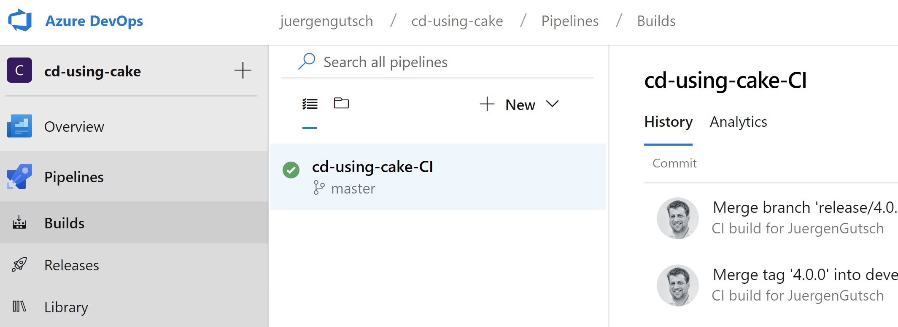

Click the "+ New" button to create a new build pipeline. For this kind of pretty simple builds I prefer to use the classic build editor to setup the pipeline. The alternatives are preconfigured or empty YAML build configurations.

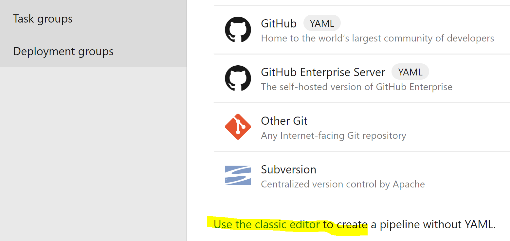

If you select the classic editor you need to select a version control as a first step. In my case it is GitHub:

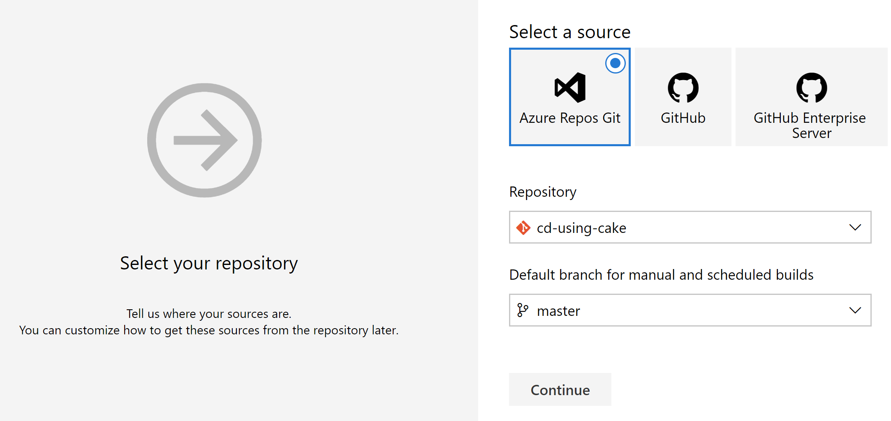

In the next step select the **Empty pipeline** which is at the very end of the list. 

In the next screen you need to specify a meaningful name and to select the Agent pool. Agent pools are a set of build agents running on specific machines. The machines are preconfigured to fulfil specific requirements. This is your build environment. you are able to choose between different build environments. For me it made sense to choose between VS2017 or VS2019 pools.

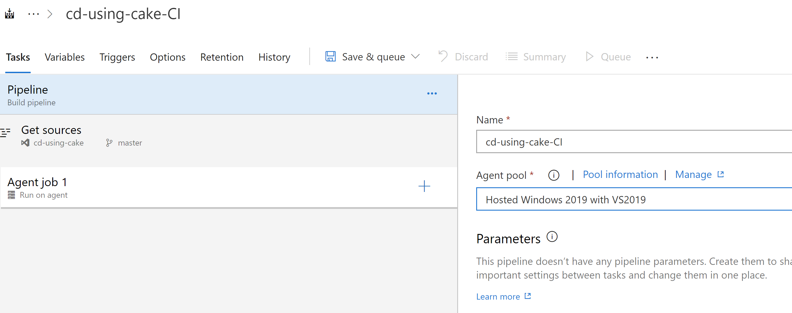

The Get sources part is already set with the initial step where we chose the repository. Click on **Agent job 1**, rename it and also choose the Agent pool you wanna use. On the right side on the **Agent job 1** item is a small **Plus** button. This is to add tasks to the Job. click that button and add the **CAKE** task to the job. You may need to get it from the Marketplace, but this is a free task and it should be easy to get it. If not you are able to use the **PowerShell** task to call the cake script.

Also add the **Publish Test Result** task as well as the **Publish Artifact** task

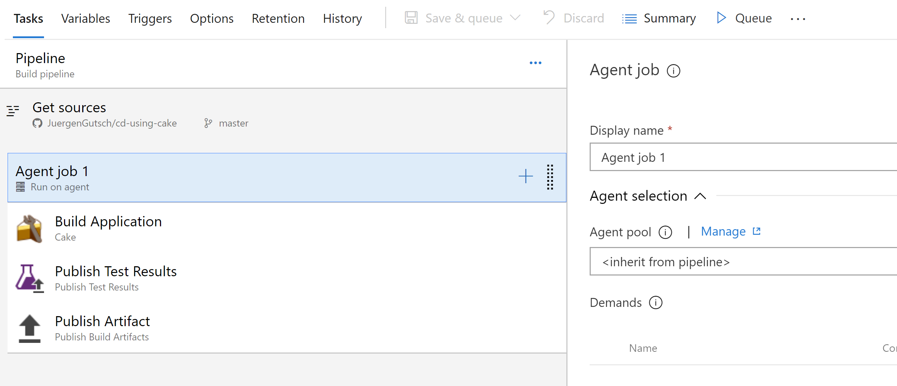

Click on the CAKE task to configure the actual CAKE build. 

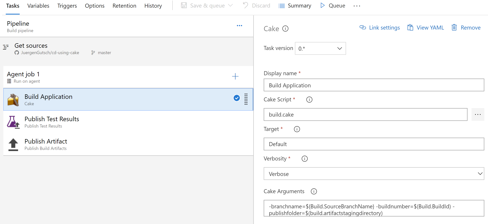

You can leave the default values except the CAKE Arguments. I add three arguments to set the current branch name, the current build number and the folder to drop the zipped artifacts:

~~~ powershell
-branchname=${Build.SourceBranchName} -buildnumber=$(Build.BuildId) -publishfolder=$(build.artifactstagingdirectory)
~~~

I use Azure DevOps variables to get those values.

The Publish Test Results Task only need the name of the test results file:

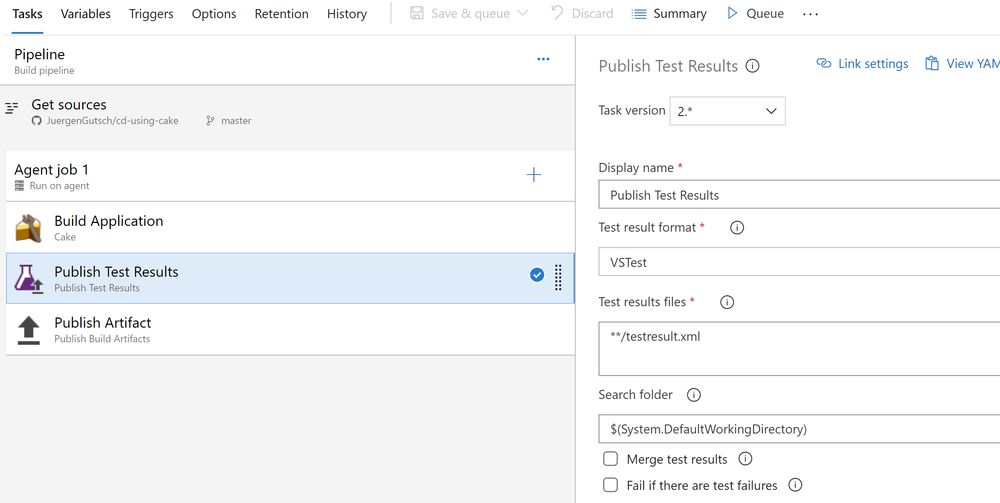

At the end of the pipeline the dropped artifact need to be moved the artifacts folder. The default values are absolutely fine here:

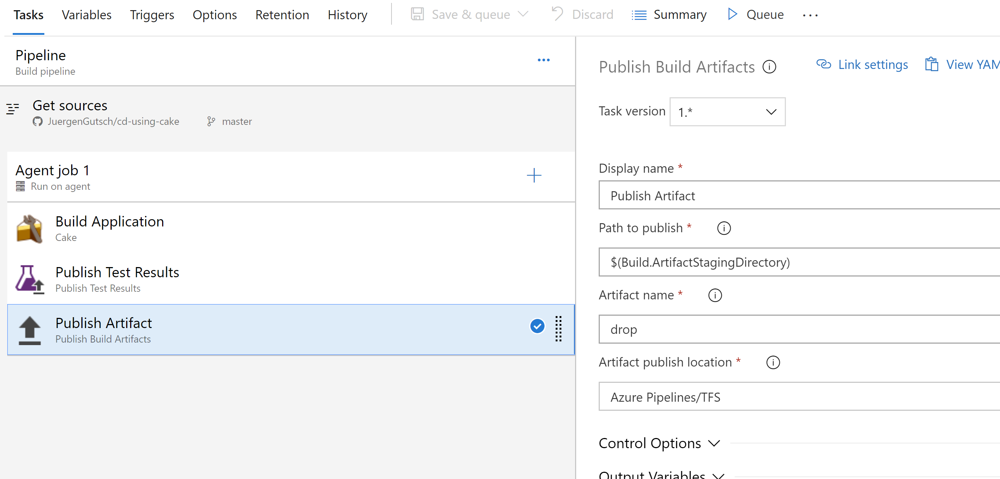

No the build is configured, but it is not a continuous integration build yet. The last step is to configure the triggers. We want to run the build on almost every commit. We want to build the feature branches, as well as the main branches master and develop:

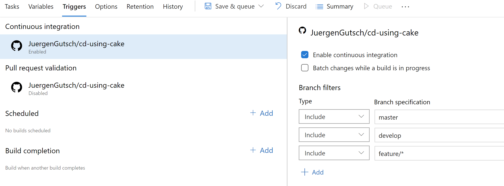

I enabled continuous integration end set branch filters to allow the specified to get built. That's it with the builds. 

In the next section we are going to configure the deployment using the releases features in Azure DevOps

## Deployment

The deployment to Azure is easy using Azure DevOps. You only need a authorized connection to a resource group on azure and to select the right App Service later on in the release configuration. There is an item to deploy a ZIP package directly to the connected App Service

The main difference between the deployment using Jenkins and Azure DevOps now is, that we did the deployment using a task in the CAKE while running on Jenkins. Now the CAKE script only does building, testing and packaging. Now the deployment is done using the release feature in Azure Pipelines. Build and Release is now independent, even if we chained both together. We start a release automatically if a build was done to deploy continuously.

Let's see how this works in the next section

### Configure continuous deployment in Azure DevOps

The configuration of a Release Pipeline is a little more complex than the Build Pipelines. But if you know why there is an additional abstraction layer, it is simple anyway.

This is because you are releasing artifacts. In our case it is a build artefact. More specific: It is the Zip package we created in the Build Pipeline. It is also because you are able to support different stages or environments. For example you can deploy the build artifact of the development branch to a development environment, where the developers are able to test and debug the application in an almost production like environment. And additionally you are able to deploy the build artifact of the master branch to an staging or production environment. Just by configuring a single Release Pipeline.

In the next screenshot you'll see two areas in the left area to configure the artifacts and the stages.

To create a new Build Pipeline you need to go to the Release and to click on "New release pipeline". After that you'll see the next screenshot where you can select a template for your Release pipeline.

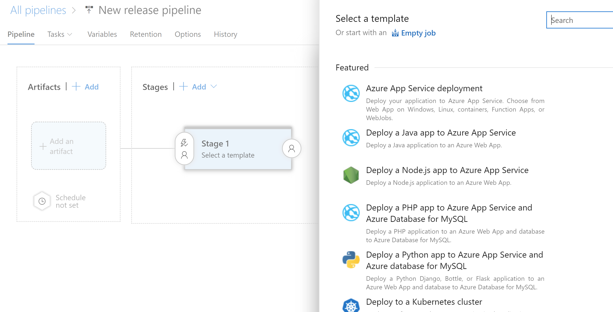

The first template is fine to deploy an ASP.NET Application to an Azure App Service. To show all the aspects I'm going to choose the empty template, which is the last one. After that you will see the next screen, where you can edit the selected Stage.

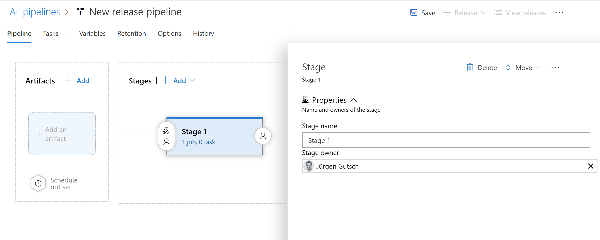

I prefer to choose the branch name as stage name. The first stage will be called `master`, because it will deploy the build artefact of the master branch. I will also add another stage and call it `develop`.

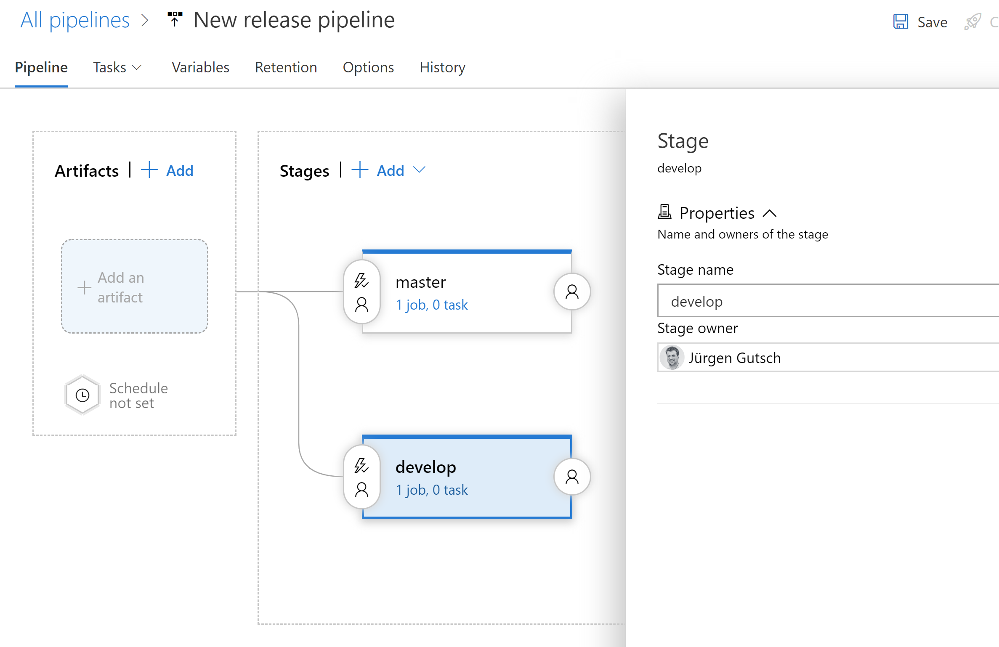

The next step is to choose the artifact we want to deploy. Click at the "Add an artifact" area to choose the output of the build pipeline we just created.

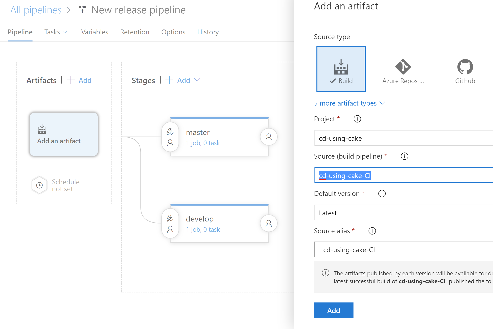

We also want to deploy continuously. So we need to tell the release pipeline to run when the build was done. After we chose the artifact, we see an small lightning icon on the artifact. Click this icon to choose the trigger for this pipeline:

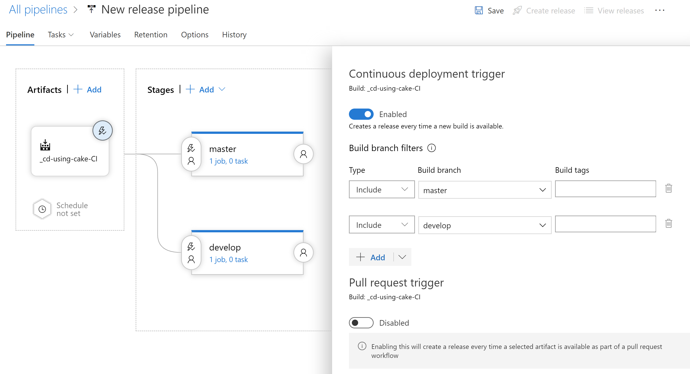

Here we need to enable the Continuous deployment trigger and to add branch filters for the `master` and the `develop` branch. This will trigger the release pipeline, if a successful build of the master or the develop branch will happen. 

As well for the stages we need to configure the trigger. We also need to select the small lightning icon the stages. Than we need to enable the artifact filter where we need to select the configured artifact where we need to choose the `master` branch:

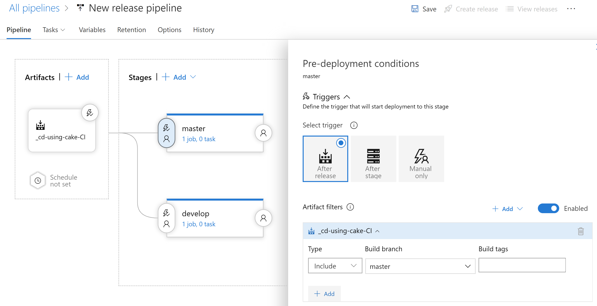

We also need to do the same thing for the `develop` stage.

If this is done the next step is to configure the  tasks of the actual pipelines. To do this you can either select one stage at the Tasks tab on the top or to choose the link on the stage:

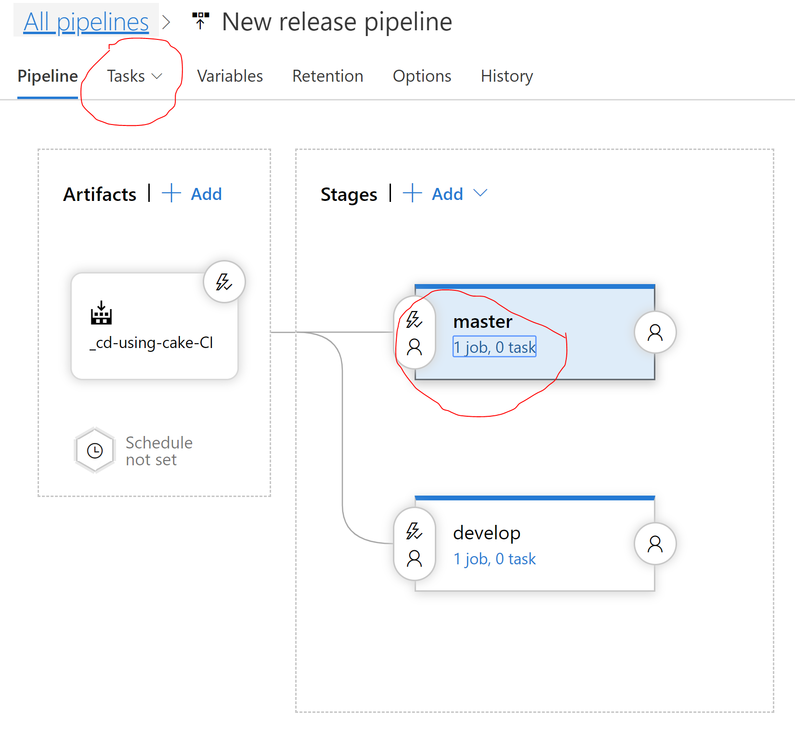

(Note to myself: Need to find a better way to draw circles in the train.)

Let's chose the `master` stage first. The view will change and we see the similar task configuration as for the builds. We have the Agent job visible where we can add tasks:

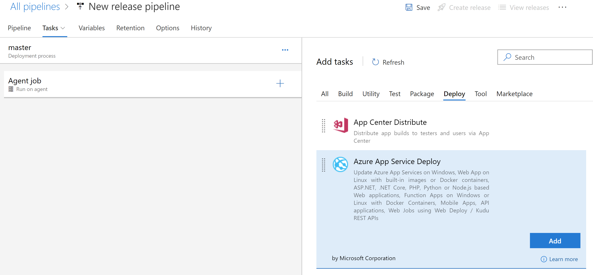

Search for the "Azure App Service Deploy" task and add it to the Agent job. Here we need to choose the Azure Subscription and the name of the Azure App Service where your application should run. The package or folder to deploy should be the default. Here you can see that the previously built Zip package will be deployed.

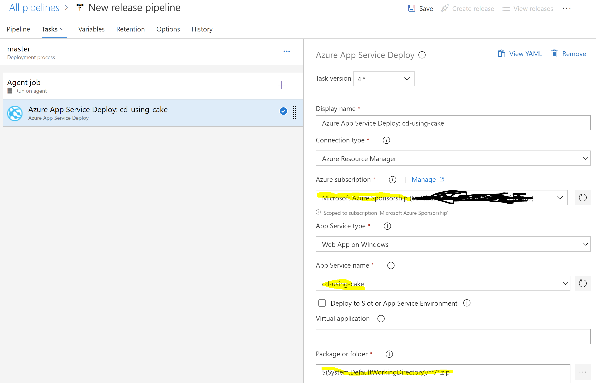

Do the same steps for the develop stage, but choose the development environment on Azure instead.

### If you don't have an Azure subscription configured yet, you need to do so first. 

If you use the same Azure Account on Azure DevOps and your Azure Portal, you will see some subscriptions here. But they are not yet configured to be used in Azure DevOps. First you need to authorize Azure DevOps to connect to this specific Azure subscription. After you selected an Subscription click, on the "Authorize" button to create an OAuth connection to Azure.

If you don't see any Subscriptions, click on manage to configure a new connection to an Azure subscription or to an Azure Resource Group. Choose "Azure Resource Manager" as a service connection type and follow the instructions to create a new connection to your Azure subscription.

## Courious?

In the next Twitch episode of Juergen On Stream (in German) I'm going to setup the entire deployment process for the Sharpcms.Core project in an development stage. 

I also have a presentation prepared, that could be interesting for your developer conference or your .NET or Azure user group. I did this talk at the dotnet Cologne this year on May 10th and at the Azure user group in Freiburg (Germany)

