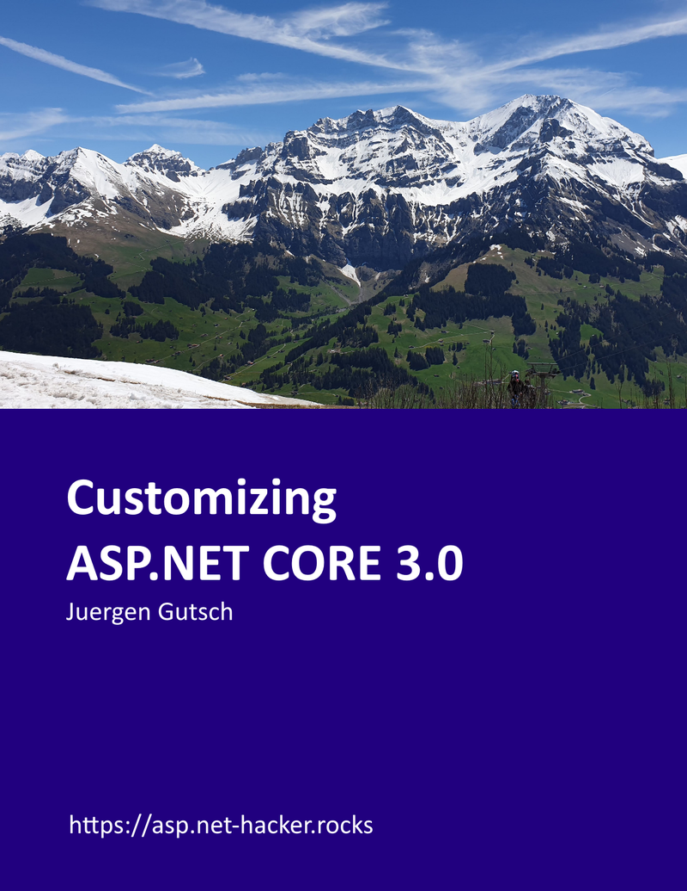

While writing on the Customizing ASP.NET Core series, a reader asked me to bundle all the posts into a book. I was thinking about it for a while. Also because I tried to write a book in the past together with a collogue at the YOO. But publishing a book with a publisher in behind turned out to be stress. Since we have a family with small kids and a job where we work on different projects, the book never has priority one. The publisher didn't see that fact. Fortunately the publisher quits the contract because we weren't able to deliver a chapter per week.

This is the planned cover. I took that photo on the Tschenten Alp above Adelboden in Switzerland:

## Leanpub

In the past I already had a look into different self publishing platforms like [Leanpub](https://leanpub.com/) which looks pretty easy and modern. But it also has a downside:

* Leanpub gives me 80 % of the salary, but we need to do the publishing and the marketing to sell that book
* A publisher only gives me 20%, but does a professional publishing and marketing. He wills ell a lot more books.

At the end you cannot get rich by publishing a book like this. But it is anyway nice to get some money out of your effort. Also Amazon provides a possibility to publish a book by yourself which looks nice for self-publisher. I'm going to try this as well.

In the past Leanpub also provides print on demand. This seemed to be stopped now. I couldn't found any information about it now. Anyway, it is good enough to publish in various eBook formats.

So I decided to go with Leanpub to try the self-publishing way.

## Writing

Even if the most of the contents are already  written for the blog, I decided to go over all the parts to also update all the stuff to ASP.NET Core 3.0. I also decided to also leave the ASP.NET Core 2.2 information, because this will also be valid for a while. So the chapter will handle 3.0 and 2.2. 

Writing for Leanopub also works with GitHub and Markdown files, which also reduces the effort. I'm able to bind a GitHub repository to Leanpub and push Markdown files into it. I need to structure and order the different files in a book.txt file. Every markdown file is a chapter in that book. 

Currently I have 13 chapters a preface, a about me chapter, a chapter to describe the technical requirements for this book and a small postface. All in all about 80 pages.

## Rewriting

Sometimes it was hard to rewrite the demos and contents to ASP.NET Core. If you are writing about customizing that goes deeply into the APIs, you will definitely face some significant changes. So it wasn't that easy to get a custom IoC container running in ASP.NET Core 3. Also adding the Middlewares using a custom Route changes from 2.2 to 3.0 Preview 3 and changes again from the preview 3 to the preview 6. Iven though I already had some experience with 3.0 there where some changes between the different previews. 

But luckily I also have some chapters without any differences between 2.2 and 3.0

## Updating the blog posts

I'm not yet sure whether I need to update the blog post or not. My current idea is to create new posts and to mention the new post in the old ones.

There is definitely enough stuff for a lot of new posts about About ASP.NET Core. One thing for example is the new Framework reference that was a pain in the ass during a live stream where I tried to update a preview 3 solution to preview 6. 

## Publishing

Currently I'm not sure when I'm able to publish this book. At the moment it is review by to people doing the non technical review and one guy doing the technical review. 

I think I'm going to publish this book during the summer.

## Contributing

If you want to help making this book better, feel free to go to the repositories, fork them and to create PRs.

* Demo project: [https://github.com/JuergenGutsch/customizing-aspnetcore](https://github.com/JuergenGutsch/customizing-aspnetcore)
* Book repository: [https://github.com/JuergenGutsch/customizing-aspnetcore-book](https://github.com/JuergenGutsch/customizing-aspnetcore-book)

It would also be helpful to propose a price you would pay for such a book. Until yet I got some proposals, but his seem to be a pretty high price from my perspective. It seems some folks are really willing to pay around 25 EUR. [https://leanpub.com/customizing-aspnetcore/](https://leanpub.com/customizing-aspnetcore/). What do you think?