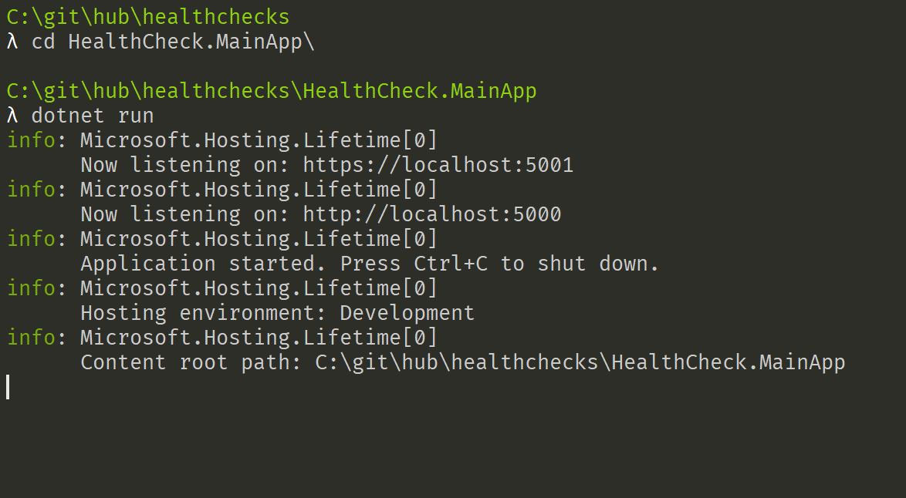
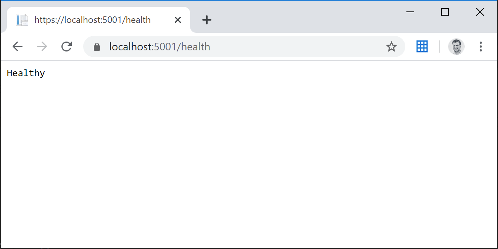

Since a while I planned to write about the ASP.NET Health Checks which are actually pretty cool. The development of the ASP.NET Core Health Checks started in fall 2016. At that time it was a architectural draft. In November 2016 during the Global MVP Summit in Redmond we got ask to hack some health checks based in the architectural draft. It was Damien Bowden and me who met Glen Condron and Andrew Nurse during the Hackathon on the last summit day to get into the ASP.NET Health Checks, to write the very first checks and to try the framework. 

> Actually, I prepared a talk about the ASP.NET Health Checks. And I would be happy to do the presentation at your user group or your conference.

## What are the health checks for?

Imagine that you are creating an ASP.NET application that is pretty much dependent on some sub systems, like a database, a file system, an API, or something like that. This is a pretty common scenario. Almost every application is dependent on a database. If the connection to the database got lost for different reasons, the application will definitely break. This is how applications are developed since years. The database is the simplest scenario to imagine what the ASP.NET health checks are good for, but not the real reason why they are developed. So let's continue with the database scenario. 

* What if, you where able the check whether the database is available or not before you connect to it. 
* What if, you where able to tell your application to show a user friendly message about the database that is not available. 
* What if, you could simply switch to a fallback database in case the actual one is not available? 
* What if, you could tell a load balancer to switch to a different fallback environment, in case your application is unhealthy because of the missing database?

You can exactly do this with the ASP.NET Health Checks:

Check the health and availability of your sub-systems, provide an endpoint that tells other systems about the health of the current application and consume health check endpoints of other systems.

health checks are mainly made for microservice environments. where loosely coupled applications need to know the health state of the systems they are depending on. But they are also useful in more monolithic applications that are dependent on some kind of subsystems and infrastructure.

# How to enable health checks?

I'd like to show the health check configuration in a new, plain and simple ASP.NET MVC project that I will create using the .NET CLI in my favorite console:

~~~shell
dotnet new mvc -n HealthCheck.MainApp -o HealthCheck.MainApp
~~~

The health checks are already in the framework and you don't need to add an separate NuGet package to use it. It is in the `Microsoft.Extensions.Diagnostics.HealthChecks` package that should be already available after the installation of the latest version of .NET Core.

To enable the health checks you need to add the relating services to the DI container:

~~~csharp
public void ConfigureServices(IServiceCollection services)
{
    services.AddHealthChecks();
    services.AddControllersWithViews();
}
~~~

This also the place where we add the checks later on. But this should be good for now.

To also provide an endpoint to tell other applications about the state of the current system you need to map a route to the health checks inside the Configure method of the Startup class:

~~~csharp
app.UseEndpoints(endpoints =>
{
    endpoints.MapHealthChecks("/health");
    endpoints.MapControllerRoute(
        name: "default",
        pattern: "{controller=Home}/{action=Index}/{id?}");
});
~~~

This will give you a URL where you can check the health state of your application. Let's quickly run the application and call this endpoint with a browser:

Celling the endpoint:

Our application is absolutely healthy. For sure, because there is no health check yet, that checks for something.

## Writing health checks

Like in many other APIs (e. g. the Middlewares) there are many ways to add health checks . The simplest way and the best way to understand how it is working is to use lambda methods:

~~~csharp
services.AddHealthChecks()
    .AddCheck("Foo", () =>
        HealthCheckResult.Healthy("Foo is OK!"), tags: new[] { "foo_tag" })
    .AddCheck("Bar", () =>
        HealthCheckResult.Degraded("Bar is somewhat OK!"), tags: new[] { "bar_tag" })
    .AddCheck("FooBar", () =>
        HealthCheckResult.Unhealthy("FooBar is not OK!"), tags: new[] { "foobar_tag" });
~~~

Those lines add three different health checks. They are named and the actual check is a Lambda expression that returns a specific `HealthCheckResult`. The result can be Healthy, Degraded or Unhealthy.

* **Healthy**: All is fine obviously.
* **Degraded**: The system is not really healthy, but it's not critical. Maybe a performance problem or something like that.
* **Unhealthy**: Something critical isn't working.

Usually a health check result has at least one tag to group them by topic or whatever. The message should be meaningful to easily identify the actual problem.

Those lines are not really useful, but show how the health check are working. If we run the app again and call the endpoint we would see a Unhealthy state, because it always shows the lowest state, which is Unhealthy. Feel free to play around with the different `HealthCheckResult`

Now let's demonstrate an more useful health check. This one pings a needed resource in the internet and checks the availability:

~~~csharp
services.AddHealthChecks()
    .AddCheck("ping", () =>
    {
        try
        {
            using (var ping = new Ping())
            {
                var reply = ping.Send("asp.net-hacker.rocks");
                if (reply.Status != IPStatus.Success)
                {
                    return HealthCheckResult.Unhealthy("Ping Unhealthy");
                }

                if (reply.RoundtripTime > 100)
                {
                    return HealthCheckResult.Degraded("Ping Degraded");
                }

                return HealthCheckResult.Healthy("Ping Healthy");
            }
        }
        catch
        {
            return HealthCheckResult.Unhealthy();
        }
    });
~~~

This won't work, because my blog runs on Azure and Microsoft doesn't allow pings there. Anyway, this demo shows you how to handle the specific results and how to return the right `HealthCheckResults` depending on the state of the the actual check.  

But it doesn't really make sense to write those tests as lambda expressions and to mess with the `Startup` class. Good there is a way to also add class based health checks. 

Also just a simple and useless one, but it demonstrates the basic concepts:

~~~csharp
public class ExampleHealthCheck : IHealthCheck
{
    public Task<HealthCheckResult> CheckHealthAsync(
        HealthCheckContext context,
        CancellationToken cancellationToken = default(CancellationToken))
    {
        var healthCheckResultHealthy = true;

        if (healthCheckResultHealthy)
        {
            return Task.FromResult(
                HealthCheckResult.Healthy("A healthy result."));
        }

        return Task.FromResult(
            HealthCheckResult.Unhealthy("An unhealthy result."));
    }
}
~~~

This class implements CheckHealthAsync method from the IHealthCheck interface. The HealthCheckContext contains the already registered health checks in the property Registration. This might be useful to check the state of other specific health checks.  