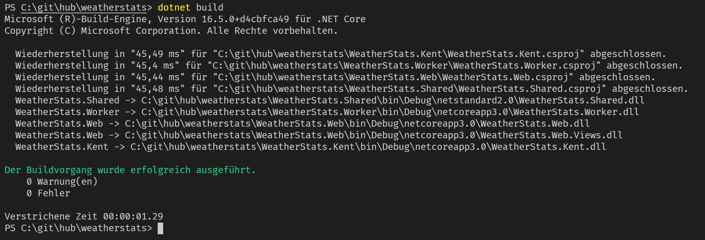

In January I wrote a post about setting up VS2019 and VSCode to use the .editorconfig

It works like it should work: In the editors. And it works in VS2019 at build-time. But it doesn't work at build time using MSBuild. This means it won't work with the .NET CLI, it won't work with VSCode and it won't work on any build server.

Actually this is a huge downside about the .editorconfig. Why shall we use the .editoconfig to enforce the code style, if a build in VSCode doesn't fail, but it fails in VS2019 does? Why shall we use the .editorconfig, if the build on a build server doesn't fail. Not all of the developers are using VS2019, sometimes VSCode is the better choice. And we don't want to install VS2019 on a build server and don't want to call vs.exe to build the sources.

The reason why it is like this is as simple as bad: The Roslyn analyzers to check the codes using the .editorconfig are not yet done. 

Actually, Microsoft is working on that and is porting the VS2019 checks to Roslyn analyzers that can be downloaded and used via NuGet. Currently, the half of the work is done and some of the analyzers can be used in the project. See here: [#33558](https://github.com/dotnet/roslyn/issues/33558)

With this post I'd like to try it out. We need this for our projects in the YOO, the company I work for and I'm really curious about how this is going to work in a real project

## Let's try it out

To try it out, I'm going to use the Weather Stats App I created in previous posts. Feel free [to clone it from GitHub](https://github.com/JuergenGutsch/weatherstats-demo/) and follow the steps I do within this post.

At first you need to add a NuGet package:

[Microsoft.CodeAnalysis.CSharp.CodeStyle](https://dotnet.myget.org/feed/roslyn/package/nuget/Microsoft.CodeAnalysis.CSharp.CodeStyle)

This is currently a development version and hosted on MyGet. This needs you to follow the installation instructions on MyGet. Currently it is the following .NET CLI command:

~~~ shell
dotnet add package Microsoft.CodeAnalysis.CSharp.CodeStyle --version 3.7.0-3.20307.1 --source https://dotnet.myget.org/F/roslyn/api/v3/index.json
~~~

The version might change in the future. 

You need to execute this command for every project in your solution.

After executing this command you'll have the following new lines in the project files:

~~~xml
<PackageReference Include="Microsoft.CodeAnalysis.CSharp.CodeStyle" Version="3.7.0-3.20307.1">
    <IncludeAssets>runtime; build; native; contentfiles; analyzers; buildtransitive</IncludeAssets>
    <PrivateAssets>all</PrivateAssets>
</PackageReference>
~~~

This should be enough to get it running. 

Unfortunately it seems I messed up with my system. It didn't work on my machine. I got a lot of errors about that an instance of the analyzers cannot be created because of a missing Microsoft.CodeAnalysis 3.6.0 Assembly like this:

` Could not load file or assembly 'Microsoft.CodeAnalysis, Version=3.6.0.0, Culture=neutral, PublicKeyToken=31bf3856ad364e35'.`

This is strange, because I thought the CodeAnanlysis assembly is already available in case Roslyn is used.

The error happens, if you do a `dotnet build` while VSCode is running the Roslyn analysers. Strange but reproduceable.

As I wrote it should work, but didn't not.

Some resources are writing about to create a ruleset file that needs to reference the analyzers and need to be linked in the csproj files.

~~~xml
<RuleSet 
    Name="CodeAnalysis Ruleset" 
    Description="This ruleset sets the severity for the Microsot.CodeAnalysis.CSharp.CodeStyle package, so it breaks on build" 
    ToolsVersion="10.0">
    <!-- Even though the IDE will correctly show errors for rule violations in .editorconfig,
         we need to explicitly set the severity in a ruleset file to get build errors for it:
         https://github.com/dotnet/roslyn/issues/30541 -->
    <!-- It doesn't really seem to matter what I put in the AnalyzerId and RuleNamespace fields,
         as long as the rule ID is correct. -->
    <Rules 
        AnalyzerId="Microsoft.CodeAnalysis.CSharp.CodeStyle" 
        RuleNamespace="Microsoft.CodeQuality.Analyzers">
        <!-- IDE0055 is the formatting analyzer from Microsoft.CodeAnalysis.CSharp.CodeStyle. -->
        <Rule Id="IDE0055" Action="Error" />
        <Rule Id="IDE0003" Action="Error" />
    </Rules>
</RuleSet>
~~~

I added this file into each project

~~~xml
  <PropertyGroup>
    <TargetFramework>netcoreapp3.0</TargetFramework>
    <CodeAnalysisRuleSet>..\editorconfig.ruleset</CodeAnalysisRuleSet>
~~~

But it is still not working. `dotnet build` still didn't fail even if I added a code style errors:

I added both, the IDE0055 errors (indentation) and the IDE0003 error (`this` keyword). The IDE shows the errors, but the build does not:

