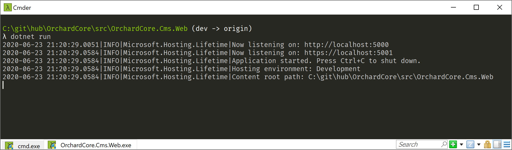
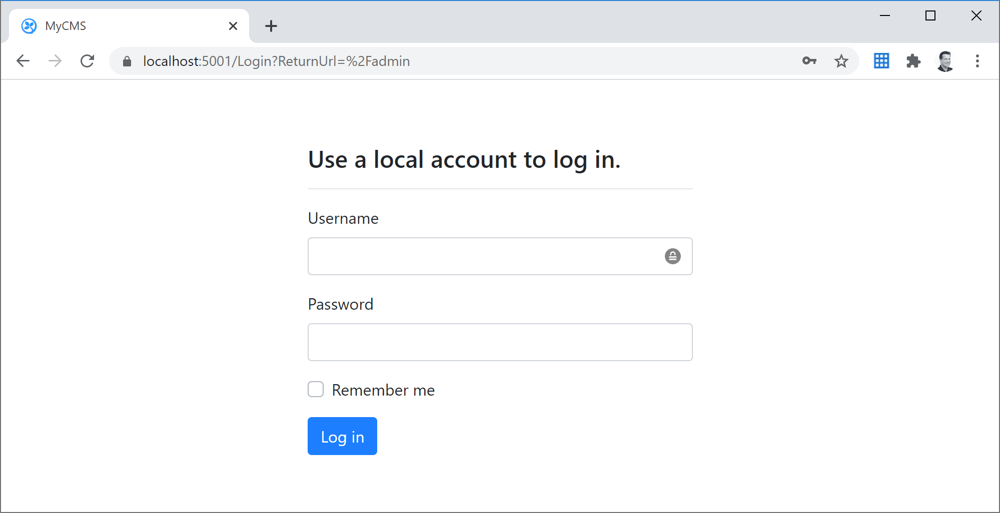
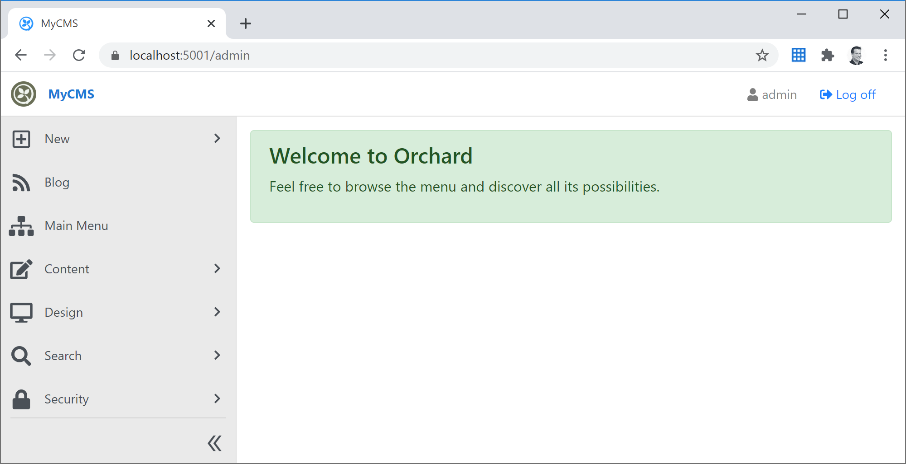
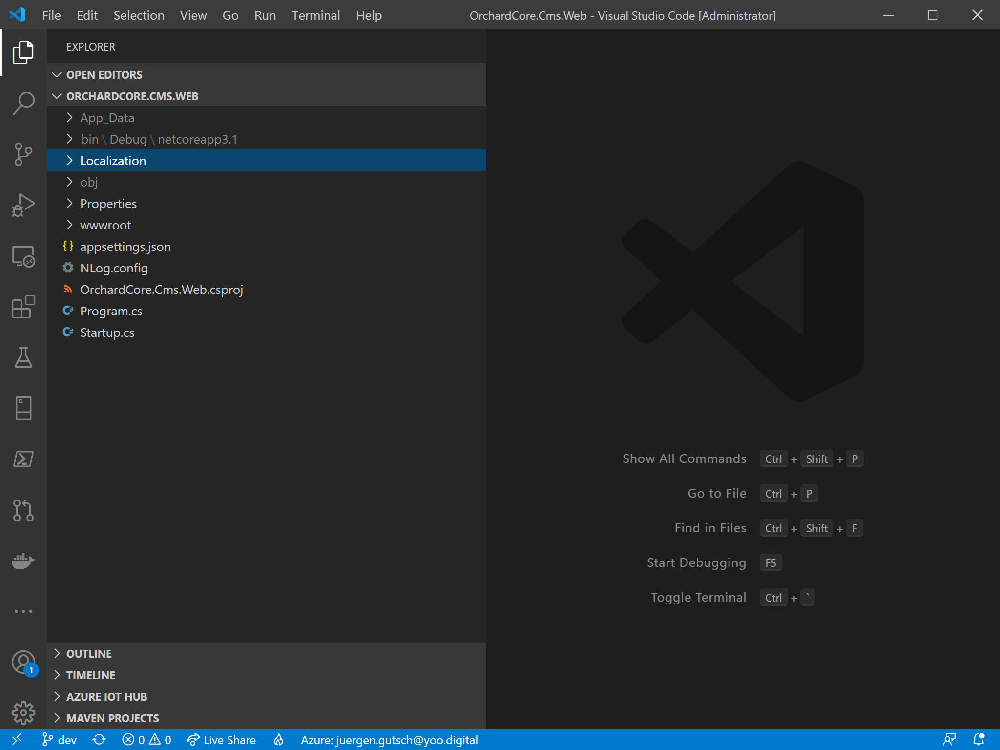
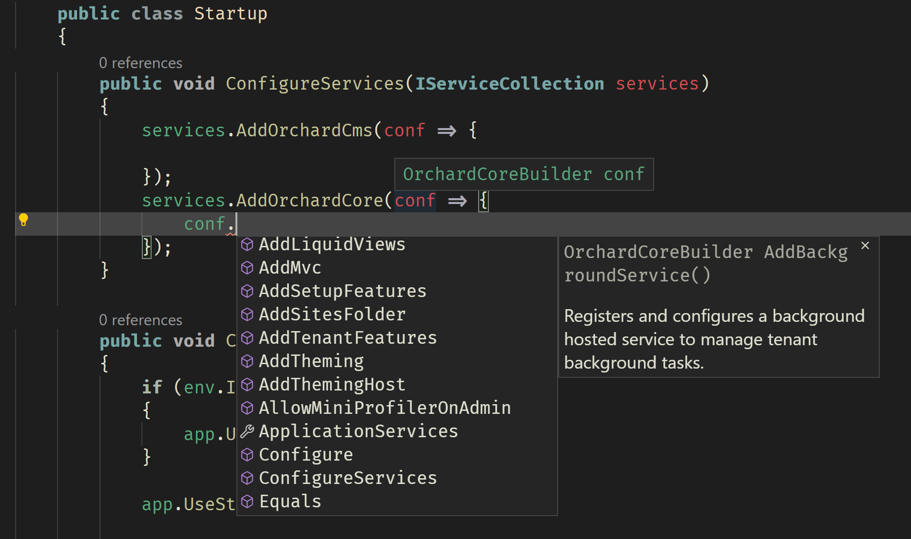

Since I while, I planned to try the Orchard Core Application Framework. Back than I saw an awesome video where [Sébastien Ros](https://github.com/sebastienros) showed an early version of Orchard Core. If I remember right it was this ASP.NET Community Standup: [ASP.NET Community Standup - November 27, 2018 - Sebastien Ros on Headless CMS with Orchard Core](https://youtu.be/4o9zG17cfa0)

## Why a blog series

Actually this post wasn't planned to be a series, but as usual the posts are getting longer and longer. The more I write, the more came in mind to write about. Bloggers now this, I guess. So I needed to decide, whether I want to write a monster blog post or a small series. Maybe the later is easier to read and to write.

## What is Orchard Core?

> Orchard Core is an open-source modular and multi-tenant application framework built with ASP.NET Core, and a content management system (CMS) built on top of that application framework.

Orchard Core is not a new version of the Orchard CMS. It is a completely new thing, written in ASP.NET Core. The Orchard CMS was designed as a CMS, but Orchard Core was designed to be an application framework that can be used to build a CMS, a blog or whatever you want to build. I really like the idea to have a framework like this.  

I don't want to repeat the stuff, that is already on the website. To learn more about it just visit it: [https://www.orchardcore.net/](https://www.orchardcore.net/)

I had a look into the Orchard CMS, back then when I was evaluating a new blog. It was goo, but I didn't really feel confident. 

Currently the RC2 is out since a couple of days and version 1 should be released in September 2020. The [roadmap](https://github.com/OrchardCMS/OrchardCore/wiki/Roadmap) already defines features for future releases.

## Let's have a first glimpse

When I try a CMS or something like this, I try to follow the quick start guide. I want to start the application up to have first look and feel. As a .NET Core fanboy I decided to use the .NET CLI to run the application. But first I have to clone the repository, to have a more detailed look later on and to run the sample application:

~~~shell
git clone https://github.com/OrchardCMS/OrchardCore.git
~~~

This clones the current RC2 into a local repository.

Than we need to cd into the repository and into the web sample:

~~~shell
cd OrchardCore\
cd src\OrchardCore.Cms.Web\
~~~

Since this should be a ASP.NET Core application, it should be possible to run the `dotnet run` command:

~~~shell
dotnet run
~~~

As usual in ASP.NET Core, I get two URLs to call the app. The HTTP version on port 5000 and the HTTPS version on port 5001.

I'm now should be able to call the CMS in the browser. Et voilà:

Since every CMS has an admin area, I try `/admin` for sure.

At the first start it asks you about to set initial credentials and stuff like this. I already did this before. At every other start I just see the log-in screen:

After the log-in I feel myself warmly welcomed... kinda :-D

Actually this screenshot is a little small, because it hides the Admin menu which is the last item in menu. You should definitely have a look into the `/admin/features` page that has a ton of features to enable.  Stuff like GraphQL API, Lucene search indexing, Markdown editing, templating, authentication providers and a lot more.

But I won't go threw all the menu items. You can just have a look by yourself. I actually want to explore the application framework. 

## I want to see some code

This is why I stopped the application and open it in VS Code and this is where the fascinating stuff is.

Ok. This is where I thought the fascinating stuff is. There is almost nothing. There are a ton of language files, an almost empty `wwwroot` folder, some configuration files and the common files like a csproj, the `startup.cs` and the `program.cs`. Except the localization part, it completely looks like an empty ASP.NET Core project. 

Where is all the Orchard stuff? I expected a lot more to see.

The Program.cs looks pretty common, except the usage of `NLog` which is provided via `OrchardCore.Logging` package:

~~~csharp
using System.Threading.Tasks;
using Microsoft.AspNetCore.Hosting;
using Microsoft.Extensions.Hosting;
using Microsoft.Extensions.Logging;
using OrchardCore.Logging;

namespace OrchardCore.Cms.Web
{
    public class Program
    {
        public static Task Main(string[] args)
            => BuildHost(args).RunAsync();

        public static IHost BuildHost(string[] args) =>
            Host.CreateDefaultBuilder(args)
                .ConfigureLogging(logging => logging.ClearProviders())
                .ConfigureWebHostDefaults(webBuilder => webBuilder
                    .UseStartup<Startup>()
                    .UseNLogWeb())
                .Build();
    }
}

~~~

This clears the default logging providers and adds the NLog web logger. It also uses the common `Startup` class which is really clean and doesn't need a lot of configuration .

~~~
using Microsoft.AspNetCore.Builder;
using Microsoft.Extensions.DependencyInjection;
using Microsoft.Extensions.Hosting;

namespace OrchardCore.Cms.Web
{
    public class Startup
    {
        public void ConfigureServices(IServiceCollection services)
        {
            services.AddOrchardCms();
        }

        public void Configure(IApplicationBuilder app, IHostEnvironment env)
        {
            if (env.IsDevelopment())
            {
                app.UseDeveloperExceptionPage();
            }

            app.UseStaticFiles();

            app.UseOrchardCore();
        }
    }
}

~~~

It only adds the services for the Orchard CMS in the method `ConfigureServices` and uses Orchard Core stuff in the method `Configure`.

Actually this Startup configures the Orchard Core as CMS. It seems I would also be able to add the Orchard Core to the `ServiceCollection` by using `AddOrchardCore()`. I guess this would just add Core functionality to the application. Let's see if I'm right. 

Both the `AddOrchardCms()` and the `AddOrchardCore()` are overloaded and can be configured using an `OrchardCoreBuilder`. Using this overloads you can add Orchard Core features to your application. I guess the method has a set of features preconfigured to acts like a CMS:

It is a lot of guessing and trying right now. But I didn't read any documentation until now. I just want to play around.

I also wanted to see what is possible with the `UseOrchardCore()` method, but this one just has on optional parameter to add an action the retrieves the `IApplicationBuilder` . I'm not sure why this action is really needed. I mean I would be able to configure ASP.NET Core features inside this action. I could also nest a lot of `UseOrchardCore()` calls. But why? 

I think, it is time to have a look into the docs at [https://docs.orchardcore.net/en/dev/](https://docs.orchardcore.net/en/dev/). Don't confuse it with the docs on   [https://docs.orchardcore.net/](https://docs.orchardcore.net/). This are the Orchard CMS docs that might be outdated now. 

The docs are pretty clear. Orchard Core comes in two different targets: The Orchard Core Framework and the Orchard Core CMS. The sample I opened here is the Orchard Core CMS sample. To learn how the Framework works, I need to clone the Orchard Core Samples repository: [https://github.com/OrchardCMS/OrchardCore.Samples](https://github.com/OrchardCMS/OrchardCore.Samples)

## Not a conclusion yet

I will continue exploring the Orchard Core Framework within the next days and continue write about it in parallel. The stuff I saw until now were really promising and I like the fact that it simply works without a lot of configuration. Exploring the new CMS would be another topic and really interesting as well. Maybe I will find some time in the future.