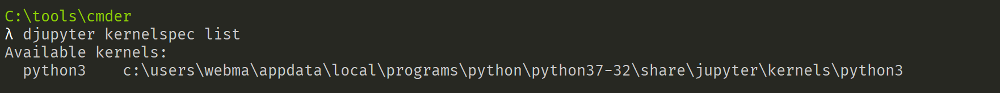
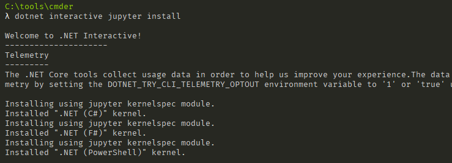
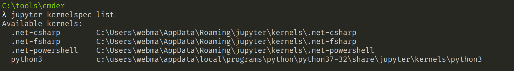
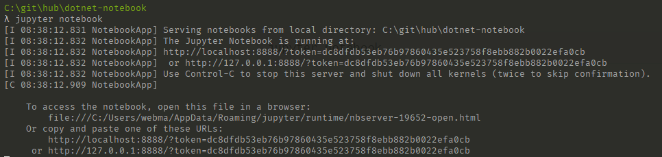
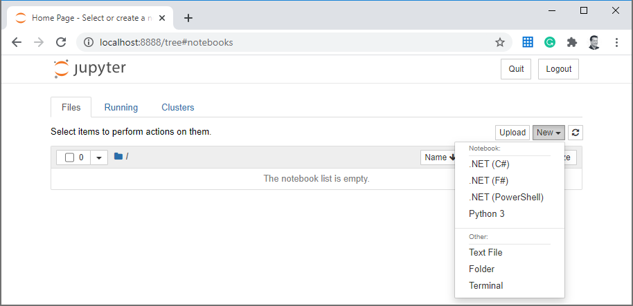
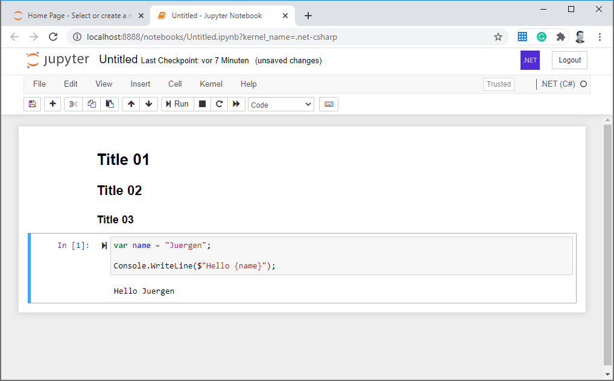

Post your content here


```shell
pip install notebook
```


```shell
jupyter kernelspec list
```
output



latest bits

```shell
dotnet tool install -g --add-source "https://dotnet.myget.org/F/dotnet-try/api/v3/index.json" Microsoft.dotnet-interactive
```

or 

```shell
dotnet tool install -g Microsoft.dotnet-interactive
```


```shell
dotnet interactive jupyter install
```



```
jupyter kernelspec list
```




```shell
jupyter notebook
```






Let's add some content and a code snippet


