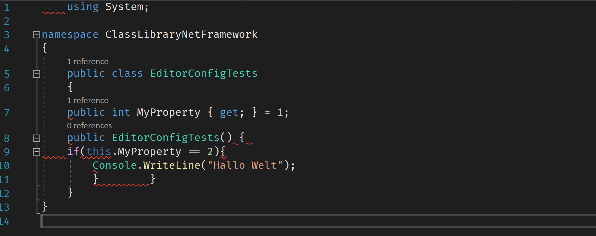
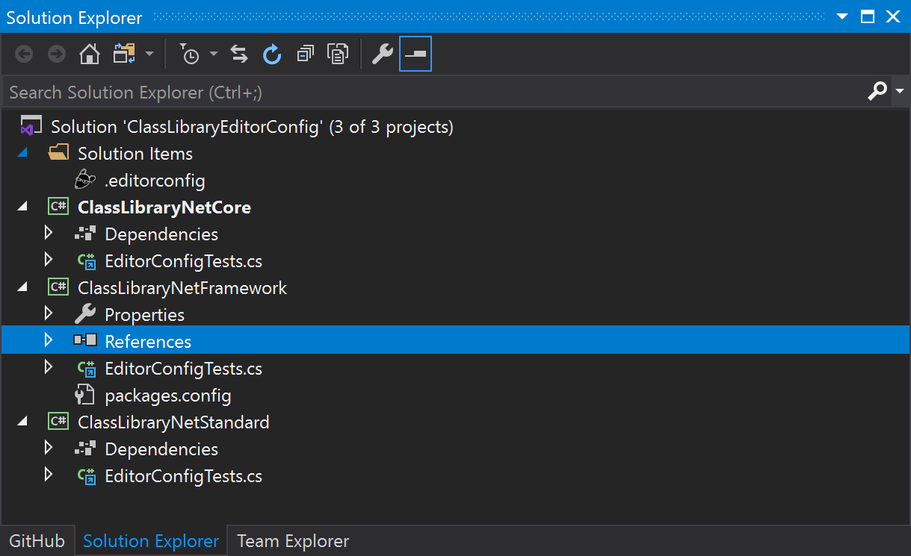
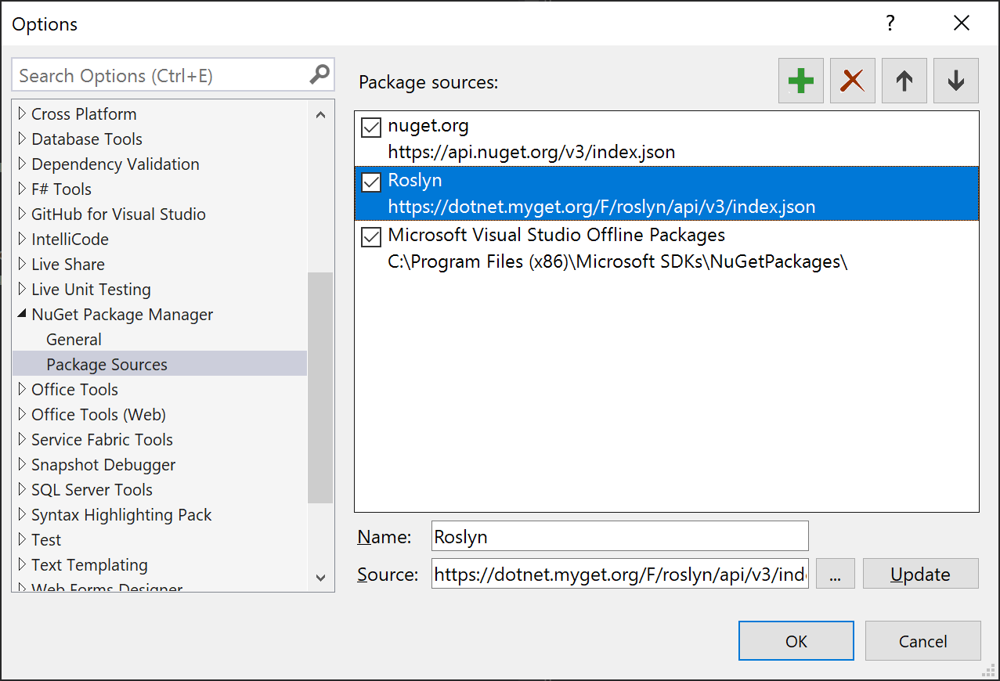

Post your content here

I demonstrated my results about the .editorconfig to the team last week. They were quite happy about the fact that the build fails on a code style error but there was one question I couldn't really answer. The Question was:

> Does this also work for .NET Framework?

Of cores it should, because it is Roslyn who analyses the code. It is not any framework who does it.

To try it out I created three different class libraries that have the same class file linked into it, with the same code style errors:

~~~csharp
    using System;

namespace ClassLibraryNetFramework
{
    public class EditorConfigTests
    {
    public int MyProperty { get; } = 1;
    public EditorConfigTests() { 
    if(this.MyProperty == 2){
        Console.WriteLine("Hallo Welt");
        }        }
    }
}
~~~

This code file has at least eleven code style errors in it:

I created a .NET Standard library, a .NET Core library, and a .NET Framework library in VS2019 this time. The solution in VS2019 now looks like this:

 

I also added the MyGet Roslyn NuGet Feed to the NuGet sources and referenced the code style analyzers:

This is the URL and the package name for you to copy:

* https://dotnet.myget.org/F/roslyn/api/v3/index.json
* Microsoft.CodeAnalysis.CSharp.CodeStyle Version: 3.8.0-1.20330.5

I also set the global.json to the latest preview of the .NET 5 SDK to be sure to use the latest tools:

~~~json
{
  "sdk": {
    "version": "5.0.100-preview.6.20318.15"
  }
}

~~~

## It didn't work

I saw some code style errors in VS2019 but not all the eleven errors I expected. I tried a build and the build didn't fail. Because I knew it worked the last time I tried it using the the dotnet CLI I did the same here. I ran `dotnet build` and `dotnet msbuild` but the build didn't fail. 

This is exactly what you don't need as a software developer: Doing things exactly the same twice and one time it works and on the other time it fails and you have no idea why. 

I tried a lot of things and compared project files, solution files, and .editorconfig files. Actually I compared it with the Weather Stats application I used in the last post. At the end I found one line in the the `PropertyGroup` of the project files of the weather application that shouldn't be there but actually was the reason why it worked. 

~~~xml
<CodeAnalysisRuleSet>..\editorconfig.ruleset</CodeAnalysisRuleSet>
~~~

While trying to get it running for the last post I also experimented with a ruleset file. The ruleset file is a XML file that can be used to enable or disable analysis rules in VS2019. I added a ruleset file to the solution and linked it into the projects, but forgot about that.

So it seemed the failing builds of the last post wasn't because of the .editorconfig but because of the ruleset file

 

