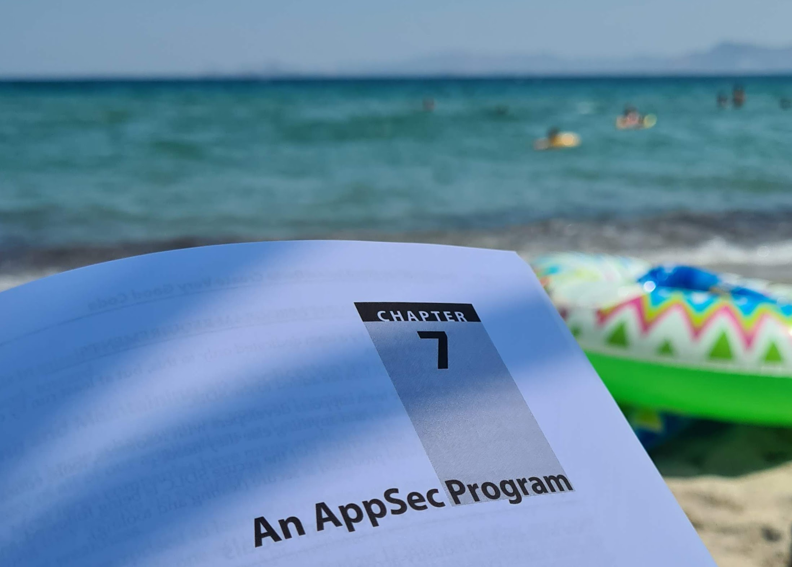

For about a year, I was working on a pretty exciting project. I defined and created a new role for our company that is responsible for application security. Actually, application security was never a missing aspect of our development process. All my colleagues were great developers and highly motivated to create secure applications. 

The actual problem was a missing standard, that sets up every project in the same secure way, which helps the QA to also test security aspects, use the same tools to improve the software quality and software security and keep the awareness on security during the entire development process.

## Defining the new role

Defining and creating this new role also means that I will take over this new role and be responsible, to ensure and to maintain the security standards throughout the entire company. I will also be responsible to keep awareness about security throughout the entire company and to train the developers, the DevOps responsible person as well as the QA. I am not the only person that is responsible for application security in general. My job will be to make all colleagues feel responsible to create secure applications. That they all have security in mind, that all features will be analyzed from the security perspective as well.

And this is why the process of secure software development doesn't start with development or DevOps. 

## Adding security to the company

Actually, the secure software development process starts at the sales phase. The salesperson needs to know what type of customer he is selling our services to, what type of data the potential customer will be handle with the new project, and what type of possible risks there are. The salesperson needs to know what level of security he needs to sell. (Exactly, we need to sell security. See next section why)

The process continues with the requirements engineering, even the UX and UI specialists need to take care of security. DevOps is following, by setting up the secure software development infrastructure and secure deployments per project. DevOps is also supporting the developers with the right tools that check for software quality and possible vulnerabilities and code flaws while building and delivering the software. In the development phase, required security aspects need to be implemented and QA needs to know how to test this. Maybe tooling will support the QA to make automated security tests.

## Selling security

True, we need to sell levels of security because ensuring application security needs some effort. The more secure the more effort during development and afterward, while ensuring and testing the application security. A potential customer in a sensitive or risky environment should know that security is not for free. A bank, a power plant, and other big and risky industry are paying for security personnel that keeps unauthorized people outside of their restricted areas. Such companies should be aware and willing to pay for implementing higher security mechanisms to keep unauthorized people out of their digitally restricted areas as well.

Actually, application security needs to be ensured in every project and the basic level of security won't be charged separately.

## What are the standards we use?

It is the [OWASP](https://owasp.org) foundation that helps me dive into new topics. We are going to implement the OWAS Application Security Verification Standard ([ASVS](https://owasp.org/www-project-application-security-verification-standard/)) and the mobile version of it (MASVS). ASVS already is divided into three levels of security. Level 1 is the basic level of security that all projects need to implement. Actually, Level 1 is quite basic and despite just a few topics, this is all stuff we as developers almost already knew, used, and implemented in the past. If we have thought about it and if the project pressure wasn't that high. Levels 2 and 3 are adding more security mechanisms to the projects to handle sensitive and critical data and infrastructure.

This standard is helping us like a blueprint for all our projects to keep the levels of security and it helps our QA to know what to test from the security point of view.

Actually, since ASVS is adopting and covering many other standards as well, we will be safe with future security audits, no matter what standard will be used during a possible audit.

## Will YOO be a secure software company?

The company already creates secure software. Since it was more or less a side aspect in the past, we'll now focus on security by following the standards and the process we have implemented.

So, yes, we can now call ourselves a secure software company. But we are not certified somehow. OWASP and ASVS are no badges nor provide certificates we can put proudly and high-nosed on our website. But we can proudly mention that we are following a standard that was created by well-known and independent security experts.

## My main role is still a software engineer :-)

The application security role is only an additional role to my position as a software engineer. In a midsized company like the YOO ensuring secure software is not such a high effort that it is needed to create a new position like an application security engineer. And therefore it is just a new additional role for me. 

Despite that, my job title will change a little bit and will be called **Software & AppSec Engineer**.

## Learning about application security

Actually, application security as a global topic was kinda new to me and I never expected that it is needed to have the entire company involved. But that also was the fun part: Talking to other disciplines and talking to people that are not really involved in my day-to-day business. It is not completely technical to implement application security in a software company.

As mentioned, the website of the [OWASP](https://owasp.org) Foundation points me to various learning resources. OWASP is full of projects to learn about application security. You might know the OWASP Top 10 list of security risks. I already mentioned the ASVS. But there is a ton more.

Another great learning resource is the Twitter feed of [Tanya Janka](https://twitter.com/shehackspurple). Her talks about application security are amazing and her book is a great read, even on vacation at the beaches of Greece while the kids are playing:

If you want to learn about application security, [follow her on Twitter](https://twitter.com/shehackspurple), [read her blog](https://shehackspurple.ca), [read her book](https://shehackspurple.ca/books/), and [watch her talks](https://shehackspurple.ca/talks/). You also need to dive into the [OWASP website](https://owasp.org) and the various projects of the foundation.

## Furthermore

And maybe, you as a software-producing company would like to adopt the same standards and processes. If you would like to know, how we created and implemented the secure software process, feel free to ask. If you need help to make your software development process more secure, we would be happy to help as well.

Learn more: [https://www.yoo.digital/applicationsecurity](https://www.yoo.digital/applicationsecurity)

## Conclusion

I'm happy to start working on my new role officially this week and I'm happy to bring the YOO a step further in creating and delivering high-quality and secure software. I'm also pretty excited about how it will go and grow over time. The implementation of a secure software process will never be complete and needs to be adjusted whenever it's needed. It is a living process that needs reviews and adjustments regularly.
